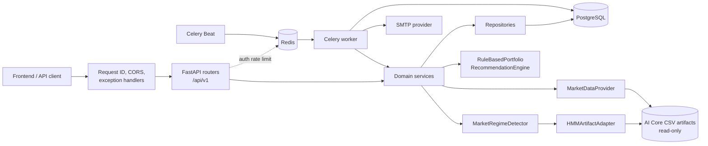
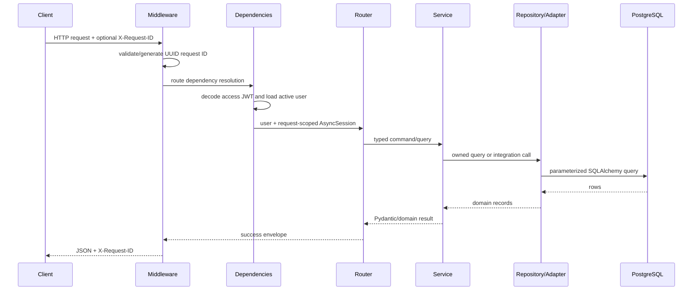
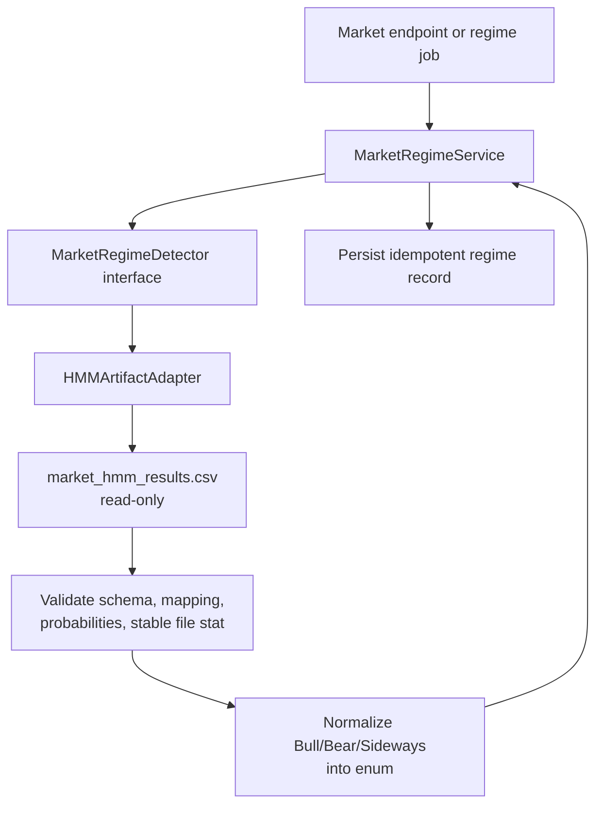
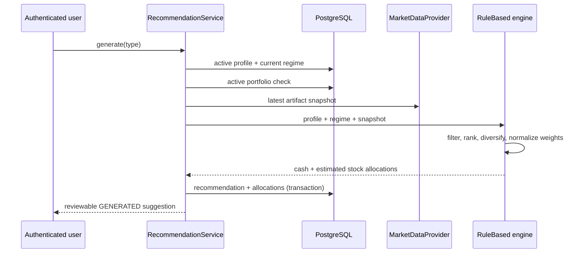
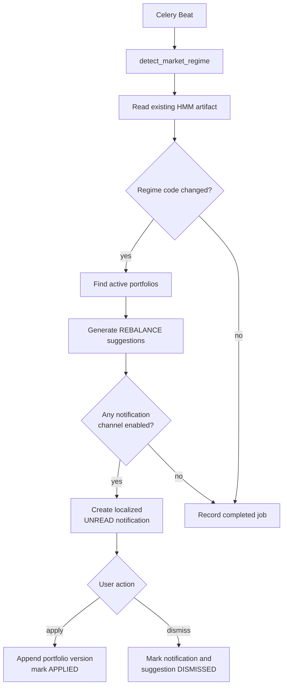

# Backend architecture

## Purpose and architectural constraints

Astera is a modular FastAPI application for simulated investment decision support. The architecture separates HTTP concerns, business rules, persistence, and external integrations so the HMM implementation never leaks into API routers.

The most important boundary is the existing AI Core repository: it is read-only. Astera does not import its source modules, run its training/prediction scripts, or create output in that tree. It reads only existing CSV artifacts through adapter interfaces.

The MVP has two distinct analytical responsibilities:

- **Market regime:** a genuine, precomputed HMM result from AI Core, normalized by `HMMArtifactAdapter`.
- **Portfolio suggestion:** a transparent, configurable `RuleBasedPortfolioRecommendationEngine`. It is not described or exposed as PPO.

All portfolios, quantities, prices, values, and performance figures are simulated estimates. No route places an order or executes a trade.

## Component map



## Source layout and responsibilities

```text
app/
  main.py                    FastAPI construction, middleware, handlers, root health
  api/
    dependencies.py          DB/auth/role and cached integration dependencies
    v1/                      Thin HTTP routers
  core/
    config.py                Pydantic settings and production-secret guard
    database.py              Async engine/session/Base
    security.py              Argon2 and JWT encoding/verification
    exceptions.py            Stable application error taxonomy
    logging.py               Structured JSON logging
    responses.py             Camel-case envelope serialization
  common/                    Enums, pagination, UTC/money/token helpers
  modules/
    auth/                    Sessions, rotation, reset/change-password flows
    users/                   User and preference ownership
    investment_profiles/     Profile validation and active-profile invariant
    stocks/                  Catalog, features, and history views
    market_regimes/          Artifact synchronization/current-regime persistence
    recommendations/         Engine interface, rule engine, persistence, expiry
    portfolios/              Confirmation, immutable versions, performance/snapshots
    notifications/           Read/apply/dismiss state machine
    history/                 Recommendation audit history and job model
  integrations/
    ai_core/                 Read-only HMM output adapter and normalized schemas
    market_data/             Read-only ticker artifact provider
    email/                   Optional SMTP adapter
  repositories/              Generic repository support; module-specific repositories
  jobs/                      Celery app, job audit wrapper, and task groups
alembic/                     Async migration environment and initial schema
scripts/                     Seed/import and AI Core integrity utilities
tests/                       Unit, integration, contract, and intentional test fakes
runtime/                     Backend-owned input/output and integrity snapshot
```

## Dependency direction

Dependencies point inward toward domain contracts:

```text
router
  -> service
     -> repository / domain interface
        -> SQLAlchemy / concrete adapter
```

Routers perform request binding, dependency injection, and response-envelope construction. They do not implement allocation or state-transition rules. Services contain business rules and transactional boundaries. Repositories contain query/load/persistence mechanics, not HTTP responses. Concrete integration adapters implement abstract domain-facing interfaces.

Cached singleton dependencies are used for the stateless HMM adapter, market-data provider, email provider, and recommendation engine. SQLAlchemy sessions remain request/job scoped.

## HTTP request flow



For public routes, authentication dependencies are omitted. For protected routes, `HTTPBearer` supplies an access token. `get_current_user` verifies the signature, expiry, `type=access`, subject, JTI, and active account, then records `user_id` in request context. User IDs are never accepted from request bodies for owned resources.

## Authentication and session lifecycle

1. Registration validates/normalizes email and password, hashes with `pwdlib`'s recommended Argon2 hasher, creates default preferences, issues access/refresh JWTs, and stores only the refresh token's SHA-256 hash.
2. Login verifies credentials and active status, records `last_login_at`, and issues a new token pair.
3. Refresh locks the stored token record, validates expiry/revocation/ownership, revokes it, and creates a new pair in the same transaction. Reuse of the previous token is rejected.
4. Logout decodes the refresh JWT and marks the matching stored token revoked. Repeating logout with a valid but already-revoked token is a no-op.
5. Password change verifies the current password and revokes every refresh token for that user.
6. Password-reset initiation invalidates earlier active reset tokens, stores a hash of a one-hour opaque token, and passes the raw value only to the email provider. Its API response is always generic.
7. Reset consumes the matching unexpired token, updates the password hash, marks the reset token used, and revokes all refresh sessions.

Login is limited to 10 attempts per client-IP hash per 60-second fixed window. Forgot-password initiation is limited to 5 attempts per 15 minutes. If Redis fails, the limiter logs degraded status and permits the request; it does not make authentication unavailable.

## Read-only AI integration flow

Strategy C, independent artifact adaptation, is selected because the AI Core has no safely importable inference entry point and no persisted HMM/preprocessing artifact set.



The adapter:

- runs blocking reads in a thread bounded by `AI_CORE_TIMEOUT_SECONDS`;
- requires `time`, `market_regime`, and `market_regime_label` columns;
- derives state-to-label mapping from the complete artifact instead of hard-coding raw state IDs;
- chooses the latest row, or latest row on/before an explicit `asOfDate`;
- validates every available posterior is finite and within `[0,1]`, and validates the vector sum;
- normalizes both `Sideway` and `Sideways` to `SIDEWAY`;
- uses the selected state's posterior as confidence, not as an accuracy claim;
- checks file stat before/after the read and rejects a concurrently changed artifact;
- fingerprints the entire artifact with SHA-256 for `modelVersion` traceability;
- records raw state/label, mapping, artifact path/hash, and `liveInference=false` in metadata.

`GET /api/v1/market/regime/current` reads the database. If no current record exists, it synchronizes once from the artifact. `POST /api/v1/market/regime/detect` is admin-only and is an artifact synchronization operation; its response explicitly says `sourceOperation=READ_ONLY_ARTIFACT_SYNC` and `liveInferencePerformed=false`.

The health adapter can return:

- `degraded`: repository/output readable, but safe live inference is absent and/or data is stale;
- `unavailable`: repository, artifact, or valid result is missing/invalid.

The current implementation never returns `healthy`, because `market_hmm.pkl` and a safe live inference path are absent. Details are exposed without pretending a fixed HMM result exists.

## Market data integration

`AICoreArtifactMarketDataProvider` reads `master_ticker_hmm_results.csv` in read-only mode. It selects the latest date with at least the configured minimum diversification coverage and caches the parsed snapshot by artifact modification time and size.

The artifact's prices are expressed in thousands of VND, so the provider multiplies OHLC/reference values by 1,000. It exposes the source ticker features used by the recommendation boundary: log return, five/twenty-day return, twenty-day volatility, volume ratio, and a derived return/volatility ratio. It does not claim RSI/MACD are HMM inputs.

Stock catalog routes ensure a database catalog exists by synchronizing the latest artifact snapshot. Historical reads scan the artifact and aggregate daily rows into weekly or monthly OHLCV in memory when requested. The optional import script persists the same real output into `stock_prices` and `stock_features`, but current API history/snapshot reads remain artifact-backed.

## Recommendation flow



The rule engine is configurable rather than a hidden model:

- cash weight is selected by regime (`BULL`, `SIDEWAY`, `BEAR`);
- maximum individual weight is selected by risk appetite;
- minimum security count is configurable and expanded when needed to satisfy the maximum weight;
- `BEAR` prioritizes lower volatility, then risk-adjusted return and momentum;
- `SIDEWAY` prioritizes risk-adjusted return, then volatility and momentum;
- `BULL` prioritizes horizon-specific momentum, then risk-adjusted return and volatility;
- equity weight is split evenly at ten-decimal precision, and cash plus stock weights must remain within `0.9999..1.0001`;
- amounts are rounded to cents and estimated quantities are floored to four decimals.

An `INITIAL` suggestion uses profile capital and is rejected when an active portfolio already exists. `RECALCULATION` and `REBALANCE` use current simulated portfolio value and require an active portfolio. Suggestions default to a 24-hour expiry and remain reviewable; they are never auto-applied.

## Portfolio versioning and performance

Confirming an `INITIAL` recommendation creates one active simulated portfolio, version 1, and version-owned allocation rows. Confirming/applying a recalculation or rebalance increments `current_version` and appends a new `portfolio_versions` row and new allocation set. Earlier versions are not updated or overwritten.

```text
Portfolio (identity/current pointer)
  -> PortfolioVersion 1 (INITIAL)
       -> PortfolioAllocation rows
  -> PortfolioVersion 2 (MANUAL_RECALCULATION or REBALANCE)
       -> independent PortfolioAllocation rows
```

The service first looks up a version by `recommendation_id`; repeating confirmation/application of an already materialized recommendation returns that portfolio record instead of intentionally creating another version. The recommendation row is locked during a new application, while `(portfolio_id,version_number)` remains the database-level uniqueness guard.

Performance uses the current version's estimated quantity multiplied by the latest reference price, plus its simulated cash amount. If a symbol is absent from the latest artifact snapshot, its invested amount is carried unchanged with zero estimated P/L and the symbol is reported in `missingSymbols`. The comparison baseline is the portfolio's original `initialCapital`; no brokerage fee, tax, slippage, dividend, or real execution is modeled.

Daily snapshot jobs upsert one snapshot per portfolio/date and update the portfolio's cached `current_value`. They do not change allocations.

## Regime-change and notification flow



A job skips a user when an equivalent `GENERATED` or `APPLIED` rebalance already exists for the same regime. Per-user domain failures are recorded as skipped reasons so one portfolio does not terminate the entire fan-out. Recommendation generation is independent of notification preferences. If both channels are disabled, no notification record is created. An email-only record is persisted with `in_app_visible=false`, remains available to SMTP delivery, and is omitted from the in-app list. Content is localized for Vietnamese language tags and otherwise falls back to English.

Notification transitions are explicit:

```text
UNREAD -> READ
UNREAD/READ -> APPLIED
UNREAD/READ -> DISMISSED
```

`APPLIED` is idempotent and returns the current portfolio. An applied notification cannot be dismissed; a dismissed notification cannot be applied. Apply creates a portfolio version and changes both recommendation and notification state in one transaction. No background task auto-applies a suggestion.

## Background processing

Celery uses Redis as broker and result backend, JSON serialization, UTC, task tracking, a prefetch multiplier of one, and hard/soft time limits derived from the AI timeout. Each task runs its async handler in a fresh event loop and disposes the async SQLAlchemy engine afterward.

Every task invocation inserts a `background_jobs` record as `RUNNING`, then records `COMPLETED` plus JSON output or `FAILED` plus a bounded error string. The wrapper re-raises failures so Celery also records task failure.

| Registered task | Beat interval | Key behavior |
|---|---:|---|
| `astera.sync_market_data` | 6 hours | Upsert catalog/latest feature boundary from read-only artifact. |
| `astera.calculate_stock_features` | On demand | Uses the same exact artifact synchronization; no AI training/calculation is run. |
| `astera.detect_market_regime` | 6 hours | Artifact sync, current comparison, optional rebalance fan-out. |
| `astera.detect_regime_change` | On demand | Compare supplied/current persisted regime records. |
| `astera.generate_rebalance_recommendations` | On demand | Generate suggestions/notifications for a supplied/current regime. |
| `astera.calculate_portfolio_snapshots` | 24 hours | Upsert estimates for active portfolios. |
| `astera.send_pending_notifications` | 5 minutes | Send up to 100 eligible unsent emails when enabled. |
| `astera.cleanup_expired_tokens` | 24 hours | Delete expired or sufficiently old revoked/used tokens. |
| `astera.expire_old_recommendations` | 30 minutes | Move elapsed `GENERATED` suggestions to `EXPIRED`. |

## Transactions and concurrency

- Refresh rotation, password reset, profile updates, recommendation state changes, portfolio application, and notification actions use row locks where competing writes are meaningful.
- Recommendation creation persists the header and allocations atomically.
- Portfolio application persists the version, allocations, recommendation status, and notification state (when notification-driven) atomically.
- Current regime persistence uses a partial unique index, an artifact-result unique key, and an idempotent retry/read path for concurrent synchronization.
- Stock catalog/import operations use unique keys and dialect-specific upserts.
- Database exceptions are rolled back by services or session context before propagation.

## Error handling and response contract

All successful and failed API results include the request ID and UTC timestamp. Pydantic models serialize aliases in camelCase.

```json
{
  "success": true,
  "data": {},
  "meta": {
    "requestId": "uuid",
    "timestamp": "2026-07-28T00:00:00+00:00"
  }
}
```

```json
{
  "success": false,
  "error": {
    "code": "RESOURCE_NOT_FOUND",
    "message": "Human-readable message",
    "details": null
  },
  "meta": {
    "requestId": "uuid",
    "timestamp": "2026-07-28T00:00:00+00:00"
  }
}
```

Exception handlers cover application errors, Pydantic request validation, FastAPI HTTP errors, SQLAlchemy errors, and uncaught errors. Production responses never include a stack trace. AI Core unavailability, timeout, invalid output, market-data unavailability, ownership/not-found, conflict, authentication, permission, and rate-limit conditions have stable error codes documented in `API_CONTRACT.md`.

The versioned database health endpoint intentionally returns HTTP 200 with `status=degraded` and `database=unavailable` if its probe fails. AI health similarly reports its state in response data. Operational health consumers must inspect the data status, not only HTTP status.

## Security model

- Passwords are hashed with Argon2 through `pwdlib`; no password or token is logged.
- JWT algorithms are constrained to the configured value; access and refresh types are checked explicitly.
- Access tokens are short-lived. Refresh tokens are rotating, revocable, and stored only as SHA-256 hashes.
- Password reset tokens are random, one-hour, one-use, and stored only as hashes.
- The application refuses its development JWT default when `APP_ENV=production`.
- User-owned queries always bind the authenticated user's UUID. Client-supplied user IDs are not accepted.
- The regime synchronization route requires `ADMIN`; the configured internal token is not currently wired to a route.
- SQLAlchemy generates parameterized SQL. UUID route arguments and pagination limits are typed/validated.
- CORS origins come from configuration; allowed headers are limited to authorization, content type, request ID, and the reserved internal-token header.
- Request validation omits submitted values from error details, reducing accidental credential disclosure.
- Email/reset failures are logged by type/code without logging reset tokens or message bodies.
- Docker mounts AI Core with `:ro`, and backend runtime output is kept under `backend/runtime`.

This is application-level security, not a substitute for production ingress controls, managed secrets, TLS, network policy, database least privilege, centralized rate limiting, monitoring, and backup policy.

## Logging and observability

Application logs are JSON. Request middleware logs `request_id`, authenticated `user_id` when present, operation, duration in milliseconds, and HTTP status. Domain/integration logs can add `error_code`, AI model version, and regime without including secrets. The request ID is accepted only when it is a valid UUID; otherwise a new UUID is generated and returned as `X-Request-ID`.

Background job outcome is additionally queryable through `background_jobs`; there is currently no public job API.

## Deployment topology

The supplied Docker Compose stack runs:

- one API service that applies Alembic migrations before starting Uvicorn;
- PostgreSQL 16 with a persistent named volume;
- Redis 7 with AOF and a persistent named volume;
- one Celery worker;
- one Celery Beat scheduler.

Every application service receives the same settings and the same AI Core read-only mount. The image runs as a non-root `astera` user and sets `PYTHONDONTWRITEBYTECODE=1`.

For multi-instance production deployment, run migrations as a controlled release step rather than concurrently in every API replica, operate Beat as a singleton, use managed persistent stores, and add an ingress/readiness policy that interprets dependency status.

## Known boundaries

- Live HMM inference is unavailable; artifact replacement belongs to an external authorized AI Core workflow.
- AI Core health is degraded even when readable because the fitted HMM and safe preprocessor contract are absent.
- PPO artifacts exist but are not used; no PPO accuracy or performance claim is made.
- Expected return and maximum drawdown are validated and snapshotted, but rule-engine v1 does not yet incorporate them into ranking or weight sizing.
- Artifact freshness/provenance must be considered before exposing recommendations as current.
- Email disabled means reset requests remain non-enumerating but no reset message is delivered.
- `INTERNAL_API_TOKEN` is reserved only; admin JWT is the implemented protection for manual regime synchronization.
- Swagger is available, while `API_CONTRACT.md` remains the authoritative human-readable response-shape supplement for the envelope-based handlers.
