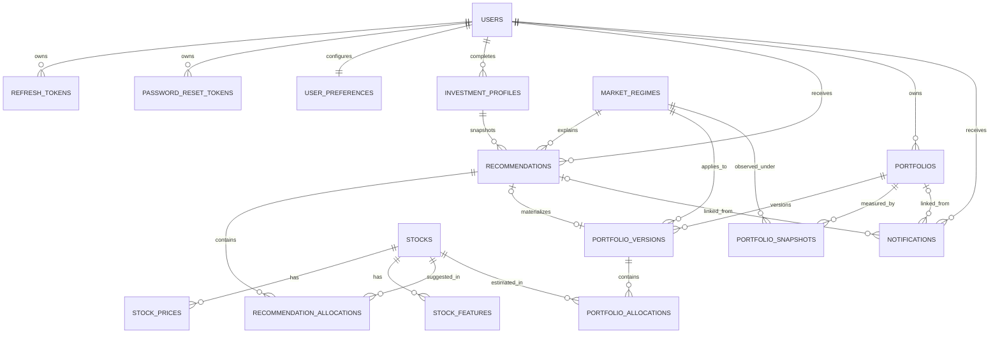

# Database design

## Overview

Astera uses SQLAlchemy 2.x async models and PostgreSQL. The initial Alembic revision `20260728_0001` creates 18 tables. Business identifiers use application-generated UUIDs. Monetary values, weights, rates, quantities, and prices use fixed-precision `NUMERIC`; money is never stored as floating point. Application timestamps are UTC-aware and database timestamp columns request timezone support.

The database stores simulated recommendations and portfolios only. Allocation and quantity columns do not represent orders, trades, or real holdings.

Two deliberate schema extensions support the implemented workflow:

- `recommendations` and `portfolio_versions` include `cash_weight` and `cash_amount`, so cash is modeled explicitly rather than as a fake stock.
- `notifications` includes `email_sent_at`, so optional email delivery is idempotently auditable and independent of in-app status.

`stock_features` also includes the source artifact's actual ticker-level HMM-era feature names (`log_return`, `return_5d`, `return_20d`, and `volume_ratio`) in addition to broader optional investment features.

## Relationship diagram



`model_versions` and `background_jobs` are audit/operations registries without required foreign keys to the transactional graph.

## Common conventions

- Primary key: `id UUID NOT NULL`, generated with UUIDv4 in the application.
- Standard timestamp mixin: `created_at`, `updated_at`; both are non-null and default to current time. Updates set `updated_at` in the application.
- Other audit tables have a non-null `created_at` but no `updated_at` because their records are immutable or state timestamps are explicit.
- Enums are stored as bounded strings with check constraints in the migration, avoiding database-native enum lifecycle coupling.
- JSON columns hold trace/audit details whose shape can evolve without changing core relational keys.
- Foreign-key delete actions are explicit: owned ephemeral children normally cascade; historical/model references normally restrict or become null.

## Tables

### 1. `users`

Account identity and authorization state.

| Column | Type | Null | Notes |
|---|---|---:|---|
| `id` | UUID | no | Primary key. |
| `email` | VARCHAR(320) | no | Unique, normalized to lowercase by services. |
| `password_hash` | VARCHAR(255) | no | Argon2 hash; never exposed. |
| `full_name` | VARCHAR(160) | no | Validated/whitespace-normalized. |
| `role` | VARCHAR(20) | no | `USER` or `ADMIN`; default `USER`. |
| `status` | VARCHAR(20) | no | `ACTIVE`, `INACTIVE`, `BLOCKED`; default `ACTIVE`. |
| `email_verified_at` | TIMESTAMPTZ | yes | Cleared if email changes. |
| `last_login_at` | TIMESTAMPTZ | yes | Updated after successful login. |
| `created_at`, `updated_at` | TIMESTAMPTZ | no | Standard audit timestamps. |

Indexes/constraints: unique `ix_users_email`; role/status checks. Deleting a user cascades to their tokens, preferences, profiles, recommendations, portfolios, and notifications.

### 2. `refresh_tokens`

Server-side refresh-session registry.

| Column | Type | Null | Notes |
|---|---|---:|---|
| `id` | UUID | no | Primary key. |
| `user_id` | UUID | no | FK to `users`, `ON DELETE CASCADE`. |
| `token_hash` | VARCHAR(64) | no | Unique SHA-256 hex digest; raw JWT is not stored. |
| `expires_at` | TIMESTAMPTZ | no | Rotation/cleanup boundary. |
| `revoked_at` | TIMESTAMPTZ | yes | Set on rotation, logout, reset, or password change. |
| `created_at` | TIMESTAMPTZ | no | Creation time. |

Indexes: `user_id`; composite `(user_id, revoked_at)` for active-session operations.

### 3. `password_reset_tokens`

One-use password-reset registry.

| Column | Type | Null | Notes |
|---|---|---:|---|
| `id` | UUID | no | Primary key. |
| `user_id` | UUID | no | FK to `users`, cascade. |
| `token_hash` | VARCHAR(64) | no | Unique SHA-256 digest of an opaque token. |
| `expires_at` | TIMESTAMPTZ | no | Service issues a one-hour lifetime. |
| `used_at` | TIMESTAMPTZ | yes | Marks token consumption/invalidation. |
| `created_at` | TIMESTAMPTZ | no | Creation time. |

Indexes: `user_id`; composite `(user_id, used_at)` for active-token invalidation.

### 4. `user_preferences`

One preference row per user.

| Column | Type | Null | Notes |
|---|---|---:|---|
| `id` | UUID | no | Primary key. |
| `user_id` | UUID | no | Unique FK to `users`, cascade. |
| `email_notifications` | BOOLEAN | no | Default true. |
| `in_app_notifications` | BOOLEAN | no | Default true. |
| `language` | VARCHAR(10) | no | Default `vi`; API accepts language tags such as `vi` or `en-US`. |
| `created_at`, `updated_at` | TIMESTAMPTZ | no | Audit timestamps. |

Registration creates the row. Read also self-heals a missing preference row.

### 5. `investment_profiles`

Version-capable profile records, with at most one active profile per user.

| Column | Type | Null | Notes |
|---|---|---:|---|
| `id` | UUID | no | Primary key. |
| `user_id` | UUID | no | FK to `users`, cascade. |
| `capital` | NUMERIC(20,2) | no | VND simulated capital. |
| `risk_appetite` | VARCHAR(20) | no | `LOW`, `MEDIUM`, `HIGH`. |
| `investment_horizon` | VARCHAR(30) | no | `SHORT_TERM`, `MEDIUM_TERM`, `LONG_TERM`. |
| `expected_return` | NUMERIC(8,6) | no | Decimal rate; API constrains to `[0,1]`. |
| `maximum_drawdown` | NUMERIC(8,6) | no | Decimal rate. |
| `is_active` | BOOLEAN | no | Default true. |
| `created_at`, `updated_at` | TIMESTAMPTZ | no | Audit timestamps. |

Checks: `capital >= 1000000`; expected return non-negative; maximum drawdown in `[0,1]`; enum value checks. Indexes: `user_id`, `(user_id,is_active)`, and partial unique `user_id WHERE is_active=true`.

The current API updates the active row in place. The schema can retain inactive historical profiles in a future workflow. Recommendations snapshot capital/risk/horizon and keep an FK to the profile used.

### 6. `stocks`

Security catalog.

| Column | Type | Null | Notes |
|---|---|---:|---|
| `id` | UUID | no | Primary key. |
| `symbol` | VARCHAR(24) | no | Unique normalized symbol. |
| `company_name` | VARCHAR(255) | no | May equal symbol when artifact lacks authoritative name. |
| `exchange` | VARCHAR(32) | no | May be `UNKNOWN` when source lacks metadata. |
| `sector`, `industry` | VARCHAR(160) | yes | Artifact/database classification. |
| `is_active` | BOOLEAN | no | Default true. |
| `created_at`, `updated_at` | TIMESTAMPTZ | no | Audit timestamps. |

Indexes: unique symbol, sector, and active flag.

### 7. `stock_prices`

Optional persisted daily OHLCV imported from the read-only ticker artifact.

| Column | Type | Null | Notes |
|---|---|---:|---|
| `id` | UUID | no | Primary key. |
| `stock_id` | UUID | no | FK to `stocks`, cascade. |
| `trade_date` | DATE | no | Market date. |
| `open_price`, `high_price`, `low_price`, `close_price` | NUMERIC(20,4) | no | Converted to VND during import. |
| `adjusted_close` | NUMERIC(20,4) | yes | Import currently mirrors close. |
| `volume` | INTEGER | no | Non-negative. |
| `created_at` | TIMESTAMPTZ | no | Import creation time. |

Unique key `(stock_id, trade_date)` enables idempotent upsert. Indexes: `stock_id`, `trade_date`.

### 8. `stock_features`

Optional persisted feature rows. Columns absent from the current artifact remain null.

| Column | Type | Null | Notes |
|---|---|---:|---|
| `id` | UUID | no | Primary key. |
| `stock_id` | UUID | no | FK to `stocks`, cascade. |
| `feature_date` | DATE | no | Feature observation date. |
| `daily_return`, `log_return` | NUMERIC(14,10) | yes | Current import maps artifact `log_return` to both. |
| `return_5d`, `return_20d` | NUMERIC(14,10) | yes | Actual artifact features. |
| `volume_ratio` | NUMERIC(18,8) | yes | Actual artifact feature. |
| `volatility_20d`, `momentum_20d` | NUMERIC(14,10) | yes | Artifact rolling volatility/20-day return. |
| `rsi_14` | NUMERIC(10,6) | yes | General/PPO-era optional field; not claimed as HMM input. |
| `macd` | NUMERIC(14,8) | yes | General/PPO-era optional field. |
| `moving_average_20`, `moving_average_50` | NUMERIC(20,4) | yes | Optional. |
| `maximum_drawdown` | NUMERIC(14,10) | yes | Optional. |
| `beta`, `sharpe_ratio` | NUMERIC(14,8) | yes | Optional/derived. |
| `feature_data` | JSON | yes | Source, reference price, ticker regime, extension metadata. |
| `created_at` | TIMESTAMPTZ | no | Import creation time. |

Unique key `(stock_id, feature_date)` enables idempotent upsert. Indexes: `stock_id`, `feature_date`.

### 9. `market_regimes`

Normalized HMM output and trace metadata.

| Column | Type | Null | Notes |
|---|---|---:|---|
| `id` | UUID | no | Primary key. |
| `code` | VARCHAR(20) | no | `BULL`, `BEAR`, `SIDEWAY`, `UNKNOWN`. |
| `name` | VARCHAR(80) | no | Display name. |
| `description` | TEXT | yes | Human-readable meaning/source context. |
| `probability` | NUMERIC(12,10) | yes | Selected state's posterior/confidence, not accuracy. |
| `detected_at` | TIMESTAMPTZ | no | Artifact modification time proxy. |
| `data_date` | DATE | yes | Actual result date. |
| `model_version` | VARCHAR(160) | yes | `hmm-output-sha256:<prefix>` artifact fingerprint. |
| `is_current` | BOOLEAN | no | Current pointer. |
| `metadata` | JSON | yes | Raw state/label, probabilities, mapping, full hash, source, live-inference flag. |
| `created_at` | TIMESTAMPTZ | no | Persistence time. |

Checks: probability null or in `[0,1]`; valid regime code. Unique `(code,data_date,model_version)` makes artifact synchronization idempotent. A partial unique index on `is_current WHERE true` guarantees at most one current regime. Supporting indexes cover current flag and data date.

### 10. `model_versions`

Model registry reserved for traceability/activation management.

| Column | Type | Null | Notes |
|---|---|---:|---|
| `id` | UUID | no | Primary key. |
| `model_type` | VARCHAR(50) | no | Logical model family. |
| `version` | VARCHAR(160) | no | External/model identifier. |
| `storage_path` | VARCHAR(500) | no | Artifact location reference. |
| `status` | VARCHAR(20) | no | `ACTIVE`, `INACTIVE`, `UNAVAILABLE`. |
| `metrics` | JSON | yes | Audited metrics only; no values are fabricated. |
| `trained_from`, `trained_to` | DATE | yes | Training range when known. |
| `activated_at` | TIMESTAMPTZ | yes | Activation time. |
| `created_at` | TIMESTAMPTZ | no | Registry insertion time. |

Index: `(model_type,status)`. The read-only adapter does not automatically fabricate/populate this registry; regime/recommendation rows carry their actual artifact/engine versions directly.

### 11. `recommendations`

Immutable input/strategy snapshot plus mutable lifecycle status.

| Column | Type | Null | Notes |
|---|---|---:|---|
| `id` | UUID | no | Primary key. |
| `user_id` | UUID | no | FK to `users`, cascade; ownership boundary. |
| `investment_profile_id` | UUID | no | FK to profile, restrict delete. |
| `regime_id` | UUID | no | FK to regime, restrict delete. |
| `type` | VARCHAR(30) | no | `INITIAL`, `RECALCULATION`, `REBALANCE`. |
| `status` | VARCHAR(30) | no | `GENERATED`, `CONFIRMED`, `APPLIED`, `DISMISSED`, `EXPIRED`, `FAILED`. |
| `capital` | NUMERIC(20,2) | no | Profile capital or current simulated value. |
| `risk_appetite` | VARCHAR(20) | no | Snapshot of profile input. |
| `investment_horizon` | VARCHAR(30) | no | Snapshot of profile input. |
| `hmm_model_version` | VARCHAR(160) | yes | Source artifact fingerprint version. |
| `portfolio_model_version` | VARCHAR(160) | no | Currently `rule-based-mvp-v1`. |
| `total_weight` | NUMERIC(12,10) | no | Stock plus cash weight. |
| `cash_weight` | NUMERIC(12,10) | no | Explicit simulated cash extension. |
| `cash_amount` | NUMERIC(20,2) | no | Explicit simulated cash extension. |
| `explanation` | TEXT | no | Reviewable rationale/disclaimer language. |
| `expires_at`, `generated_at` | TIMESTAMPTZ | no | Lifecycle times. |
| `confirmed_at` | TIMESTAMPTZ | yes | First materialization time. |
| `created_at` | TIMESTAMPTZ | no | Persistence time. |

Checks: capital minimum; enum values; `total_weight` in `[0.9999,1.0001]`; cash weight in `[0,1]`; cash amount non-negative. Indexes: `(user_id,generated_at)` and `(status,expires_at)`.

### 12. `recommendation_allocations`

Estimated stock allocations belonging to a recommendation.

| Column | Type | Null | Notes |
|---|---|---:|---|
| `id` | UUID | no | Primary key. |
| `recommendation_id` | UUID | no | FK to recommendation, cascade. |
| `stock_id` | UUID | no | FK to stock, restrict. |
| `weight` | NUMERIC(12,10) | no | Stock weight. |
| `amount` | NUMERIC(20,2) | no | Estimated VND allocation. |
| `reference_price` | NUMERIC(20,4) | no | Artifact reference price in VND. |
| `quantity_estimated` | NUMERIC(20,4) | no | Simulation quantity, not a holding. |
| `reason` | TEXT | no | Selection rationale. |
| `rank` | INTEGER | no | Deterministic recommendation ordering. |
| `created_at` | TIMESTAMPTZ | no | Creation time. |

Unique `(recommendation_id,stock_id)`. Checks enforce weight `[0,1]`, amount/quantity non-negative. Composite index `(recommendation_id,rank)` supports ordered loading.

### 13. `portfolios`

Stable simulated portfolio identity and pointer to its latest immutable version.

| Column | Type | Null | Notes |
|---|---|---:|---|
| `id` | UUID | no | Primary key. |
| `user_id` | UUID | no | FK to `users`, cascade. |
| `name` | VARCHAR(160) | no | Current service uses `Astera simulated portfolio`. |
| `status` | VARCHAR(20) | no | `ACTIVE` or `ARCHIVED`. |
| `current_version` | INTEGER | no | Latest version number, minimum 1. |
| `initial_capital` | NUMERIC(20,2) | no | Original confirmed capital, minimum VND 1,000,000. |
| `current_value` | NUMERIC(20,2) | no | Cached estimate updated by apply/snapshot flows. |
| `confirmed_at` | TIMESTAMPTZ | no | Initial creation time. |
| `created_at`, `updated_at` | TIMESTAMPTZ | no | Audit timestamps. |

Index `(user_id,status)` and partial unique `user_id WHERE status='ACTIVE'` guarantee one active simulated portfolio per user.

### 14. `portfolio_versions`

Append-only portfolio allocation versions.

| Column | Type | Null | Notes |
|---|---|---:|---|
| `id` | UUID | no | Primary key. |
| `portfolio_id` | UUID | no | FK to portfolio, cascade. |
| `recommendation_id` | UUID | yes | FK to recommendation, `SET NULL`; used by the service to find an already materialized suggestion. |
| `version_number` | INTEGER | no | Monotonic within portfolio. |
| `change_type` | VARCHAR(40) | no | `INITIAL`, `REBALANCE`, `MANUAL_RECALCULATION`. |
| `regime_id` | UUID | no | FK to regime, restrict. |
| `total_value` | NUMERIC(20,2) | no | Capital basis when effective. |
| `cash_weight` | NUMERIC(12,10) | no | Explicit simulated cash extension. |
| `cash_amount` | NUMERIC(20,2) | no | Explicit simulated cash extension. |
| `effective_at` | TIMESTAMPTZ | no | Version effective time. |
| `created_at` | TIMESTAMPTZ | no | Persistence time. |

Unique `(portfolio_id,version_number)`; checks enforce positive version number, valid change type, cash weight `[0,1]`, and non-negative cash amount. Index `(portfolio_id,effective_at)` supports history reads.

The current migration does not add a unique constraint to `recommendation_id`. The service locks the recommendation and checks for an existing version, while `(portfolio_id,version_number)` prevents duplicate version numbers. If future deployment allows highly concurrent application paths, adding a database-level unique constraint for non-null `recommendation_id` is a hardening migration to evaluate.

### 15. `portfolio_allocations`

Estimated stock positions owned by one portfolio version.

| Column | Type | Null | Notes |
|---|---|---:|---|
| `id` | UUID | no | Primary key. |
| `portfolio_version_id` | UUID | no | FK to version, cascade. |
| `stock_id` | UUID | no | FK to stock, restrict. |
| `weight` | NUMERIC(12,10) | no | Version-specific stock weight. |
| `invested_amount` | NUMERIC(20,2) | no | Estimated amount. |
| `entry_price` | NUMERIC(20,4) | no | Reference price at version creation. |
| `estimated_quantity` | NUMERIC(20,4) | no | Simulated quantity. |
| `created_at` | TIMESTAMPTZ | no | Creation time. |

Unique `(portfolio_version_id,stock_id)` and weight check `[0,1]`. Index on `portfolio_version_id`. Rows are never rewritten when a new version is applied.

### 16. `portfolio_snapshots`

Daily/reference-date performance estimates.

| Column | Type | Null | Notes |
|---|---|---:|---|
| `id` | UUID | no | Primary key. |
| `portfolio_id` | UUID | no | FK to portfolio, cascade. |
| `snapshot_date` | DATE | no | Artifact market-data date. |
| `total_value` | NUMERIC(20,2) | no | Estimated current version value. |
| `profit_loss` | NUMERIC(20,2) | no | Difference from original initial capital. |
| `pnl_percent` | NUMERIC(14,8) | no | Decimal ratio, not percentage points. |
| `regime_id` | UUID | yes | FK to regime, `SET NULL`. |
| `created_at` | TIMESTAMPTZ | no | Creation time. |

Unique `(portfolio_id,snapshot_date)` allows the job to update the same date rather than duplicate it. Index on `snapshot_date` supports time-range operations.

### 17. `notifications`

User-owned in-app action prompts and delivery audit.

| Column | Type | Null | Notes |
|---|---|---:|---|
| `id` | UUID | no | Primary key. |
| `user_id` | UUID | no | FK to user, cascade. |
| `type` | VARCHAR(50) | no | Current regime fan-out uses `MARKET_REGIME_REBALANCE`. |
| `title` | VARCHAR(200) | no | Display title. |
| `summary` | TEXT | no | Reviewable non-execution description. |
| `recommendation_id` | UUID | yes | FK to recommendation, `SET NULL`. |
| `portfolio_id` | UUID | yes | FK to portfolio, `SET NULL`; current regime job leaves it null. |
| `status` | VARCHAR(20) | no | `UNREAD`, `READ`, `APPLIED`, `DISMISSED`. |
| `in_app_visible` | BOOLEAN | no | Channel snapshot; false keeps email-only records out of the in-app list. |
| `read_at`, `actioned_at` | TIMESTAMPTZ | yes | State transition times. |
| `email_sent_at` | TIMESTAMPTZ | yes | SMTP audit/idempotency extension. |
| `created_at` | TIMESTAMPTZ | no | Creation and list-sort time. |

Index `(user_id,status,created_at)` supports owned filtered lists, which additionally filter on
`in_app_visible=true`. Direct owned lookup remains possible for action links. The current global
pending-email query has no dedicated `email_sent_at` index; add one if delivery volume warrants
it.

### 18. `background_jobs`

Application-level audit for Celery task invocations.

| Column | Type | Null | Notes |
|---|---|---:|---|
| `id` | UUID | no | Primary key. |
| `job_type` | VARCHAR(80) | no | Stable task operation name. |
| `status` | VARCHAR(20) | no | `PENDING`, `RUNNING`, `COMPLETED`, `FAILED`; executor inserts `RUNNING`. |
| `started_at`, `finished_at` | TIMESTAMPTZ | yes | Execution bounds. |
| `input_data`, `output_data` | JSON | yes | Non-secret task audit payloads. |
| `error_message` | TEXT | yes | Bounded exception class/message on failure. |
| `created_at` | TIMESTAMPTZ | no | Record creation. |

Index `(job_type,status)` supports operational queries. There is no public job API in the MVP.

## Enumerated values

| Domain | Values |
|---|---|
| User role | `USER`, `ADMIN` |
| User status | `ACTIVE`, `INACTIVE`, `BLOCKED` |
| Risk appetite | `LOW`, `MEDIUM`, `HIGH` |
| Investment horizon | `SHORT_TERM`, `MEDIUM_TERM`, `LONG_TERM` |
| Market regime | `BULL`, `BEAR`, `SIDEWAY`, `UNKNOWN` |
| Recommendation type | `INITIAL`, `RECALCULATION`, `REBALANCE` |
| Recommendation status | `GENERATED`, `CONFIRMED`, `APPLIED`, `DISMISSED`, `EXPIRED`, `FAILED` |
| Portfolio status | `ACTIVE`, `ARCHIVED` |
| Portfolio change | `INITIAL`, `REBALANCE`, `MANUAL_RECALCULATION` |
| Notification status | `UNREAD`, `READ`, `APPLIED`, `DISMISSED` |
| Job status | `PENDING`, `RUNNING`, `COMPLETED`, `FAILED` |
| Model status | `ACTIVE`, `INACTIVE`, `UNAVAILABLE` |

AI Core's `Sideways` label is normalized to `SIDEWAY` at the integration boundary; source data is not rewritten.

## Delete policy summary

| Parent relation | Delete behavior | Reason |
|---|---|---|
| User -> tokens/preferences/profile/recommendations/portfolios/notifications | `CASCADE` | User-owned data lifecycle. |
| Stock -> prices/features | `CASCADE` | Derived market data follows catalog record. |
| Stock -> recommendation/portfolio allocations | `RESTRICT` | Preserve financial audit references. |
| Profile/regime -> recommendation | `RESTRICT` | Preserve suggestion provenance. |
| Portfolio -> versions/snapshots | `CASCADE` | Version graph belongs to portfolio. |
| Version -> allocations | `CASCADE` | Allocation set belongs to version. |
| Recommendation -> recommendation allocations | `CASCADE` | Allocation set belongs to suggestion. |
| Recommendation -> portfolio version/notification | `SET NULL` | Preserve applied version/notification if source is removed. |
| Regime -> portfolio version | `RESTRICT` | Preserve version traceability. |
| Regime -> snapshot | `SET NULL` | Preserve value history while allowing registry maintenance. |

Application code does not expose destructive user/account/model endpoints in this MVP.

## Versioning strategy

Portfolio allocations are append-only by design:

1. A `GENERATED` recommendation and its allocation rows form a reviewable snapshot.
2. Confirmation/application creates a `portfolio_versions` row and copies every recommendation allocation into new version-owned rows.
3. `portfolios.current_version` advances only for a new applied version.
4. Earlier version/allocation rows remain unchanged and are listed chronologically.
5. `portfolio_snapshots` measure the current version by date without replacing its allocations.

Recommendation rows also snapshot profile and model inputs. Later profile or regime changes do not rewrite historical suggestions.

## Current-record invariants

PostgreSQL partial unique indexes enforce:

- at most one active investment profile per user;
- at most one active portfolio per user;
- at most one `market_regimes.is_current=true` row globally.

Services use row locks and transactions to uphold these invariants under concurrency. Artifact result uniqueness makes re-reading the same HMM output idempotent.

## Migration operations

From `backend/` with `DATABASE_URL` configured:

```bash
alembic upgrade head
alembic current
alembic history
```

Create a future revision only after updating SQLAlchemy models:

```bash
alembic revision --autogenerate -m "describe change"
```

Review generated SQL, constraints, indexes, delete actions, and PostgreSQL/SQLite test compatibility before applying it. Downgrading the initial revision drops all 18 tables and is destructive; back up production data and use a controlled migration process.

Revision `20260729_0002` adds the non-null `notifications.in_app_visible` channel snapshot with a
safe `true` default for existing rows.

## Data precision and interpretation

- VND money: normally `NUMERIC(20,2)`.
- Reference/OHLC/entry prices and estimated quantities: `NUMERIC(20,4)`.
- Weights/confidence: up to ten decimal places.
- Rates/P&L ratios are decimal fractions (`0.10` means 10%).
- API serialization emits decimals as JSON strings under Pydantic's JSON mode; clients must use decimal-safe parsing for calculations.
- HMM `probability` is a posterior confidence for the selected raw state, not a measured success probability.
